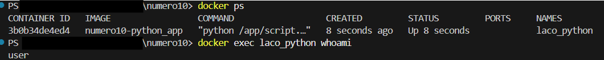

## Treino Docker
Consiste em uma lista com várias aplicações dos comandos de docker e realiza tarefas utilizando imagens bem conhecidas

1. Criando um arquivo Dockerfile que utilizando a imagem alpine como base e imprimindo a mensagem Olá, Docker! ao ser executada.  
Construindo a imagem com o nome meu-echo e execute um container a partir dela.

Para isto, foi criado o arquivo Dockerfile abaixo.
```Dockerfile
FROM alpine:3.21.3
CMD echo 'Olá, Docker!'
```
Este exercício consiste em usar uma imagem bem reduzida do sistema operacional linux para execução de programas simples e utilizando baixo armazenamento de arquivos.

Para construir a imagem, digita-se no prompt de comando 
```
docker build . -t exercicio01
```
e para executar a imagem é utilizado o comando
```
docker run exercicio01
```

Após a mensagem o conteiner é imediatamente eliminado pois não há processos que persistem a execução do mesmo.

2. Criando um container com Nginx que sirva uma página HTML customizada (index.html). Montando um volume local com esse arquivo para que ele apareça na raiz do site (/usr/share/nginx/html).
è necessario criar o volume
```
docker volume create exercicio02
```
Para criar um conteiner que execute o nginx, utilizamos o Dockerfile
```
FROM nginx:1.28.0
```
e executamos o seguinte comando para construir a imagem
```
docker build . -t exercicio02
```
e executar a inicialização do conteiner
```
run -d --name site -v exercicio2:/usr/share/nginx/html site
```
Para enviar o arquivo index.html usamos o codigo
```
COPY ./index.html /usr/share/nginx/html/index.html
```
Com isto é o suficiente para ser acessado a página via http://localhost.

No caso específico, houve um erro de firewall que não foi possível corrigir e assim foi necessario apontar a porta de saída da imagem para outra porta existente no computador hospedeiro. Isto é feito usando a flag `-p 8080:80`, assim a porta 8080 no conteiner será a porta 80 do computador hospedeiro. 

Temos portanto o comando a ser executado para o conteiner
```
docker run
run -d --name site -v exercicio2:/usr/share/nginx/html -p 8080:80 site 
```

3. Iniciar um container da imagem ubuntu com um terminal interativo (bash). Naveguar pelo sistema de arquivos e instalar o pacote curl utilizando apt.

Para criar um conteiner ubuntu,  basta criar um arquivo dockerfile do tipo
```
FROM ubuntu:24.04
``` 
Para construir a imagem usamos
```
docker build . -t numero03
```
e para iniciar o modo interativo para instalar o pacote curl usamos o comando
```
docker run -it numero03
```
Para instalar o pacote, atualizamos a lista de pacotes.
```
apt update
```
Após isto, instalamos o pacote
```
apt install curl
```

4. Subir um container do MySQL (pode usar a imagem mysql:5.7), utilizando um volume nomeado para armazenar os dados. Criar um banco de dados, parar o container, subir novamente e verifique se os dados persistem.
Para criar a imagem, criamos o arquivo Dockerfile
```
docker build . -t numero04
```
Para criar o volume persistente usamos o codigo
```
docker volume create <volume>
```
Para executar o conteiner usamos o codigo
```
docker run --name numero04 -v <volume>:/var/lib/mysql -e MYSQL_ROOT_PASSWORD= <senha> -d numero04
```
onde <senha> será a senha do servidor mysql.
Para acessar o mysql via terminal, usamos o comando
```
docker exec -it numero04 bash
```
Para criar o servidor, usamos os seguintes passos:

Acessar o mysql
```
mysql -p
```
digitar a senha criada na geração de imagem. Criar o banco de dados
```
create database usuarios;
```
Selecionar o banco de dados
```
use usuarios;
```
Criar uma tabela
```
create table teste(
    id integer,
    nome varchar(255),
    primary key(id)
    );
```
Onde temos somente duas colunas, id como chave primária com forma de numero e nome como string
Para inserir os dados, utilizamos 
```
insert into teste(id, nome) values (1, '<nome>');
```
Assim, é possível verificar se há dados usando
```
SELECT * FROM teste;
```
Para sair do servidor mysql usamos o comando `quit`. Para sair do conteiner, usamos o comando `exit`
Para excluir o conteiner, usamos o comando
```
docker rm numero04
```
Para verificar se os dados estão integros, suba novamente o conteiner
```
docker run --name numero04 -v <volume>:/var/lib/mysql -e MYSQL_ROOT_PASSWORD= <senha> -d numero04
```
Acesse o mysql
```
mysql -p
```
Selecionar o banco de dados
```
use usuarios;
```
e usar a busca
```
SELECT * FROM teste;
```
5. Criar um conteiner com a imagem alpine passando uma variável de ambiente chamada MEU_NOME com seu nome. Executar o conteiner e imprimir o valor da variável com o comando echo.
Para criar a imagem com a variável de ambiente usamos o Dockerfile
```
FROM alpine:3.21.3
ENV MEU_NOME=<nome>
```
Criamos a imagem com o comando
```
docker build . -t numero05
```
Para executar em modo interativo usamenos o comando
```
docker run -it numero05
```
Para verificar se há realmente a variável global, digite o codigo
```
echo $MEU_NOME
```

6. Utilizar um multi-stage build para otimizar uma aplicação Go, reduzindo o tamanho da imagem final. Utilizar para praticar o projeto [GS PING](https://github.com/docker/docker-gs-ping) desenvolvido em Golang.

Um multi-stage build baixa camadas de imagens distintas e assim reduzir o tamanho final do conteiner. O exemplo do projeto no link já apresenta o dockerfile.multistage, sendo necessário somente executar o comando 
```
docker build -t numero06 -f Dockerfile.multistage .
```
O arquivo faz download de camadas da imagem golang:1.19 e gcr.io/distroless/base-debian11 para realizar esse processo.

Caso esteja indisponível, o arquivo em questão é:
```
# syntax=docker/dockerfile:1

##
## Build the application from source
##

FROM golang:1.19 AS build-stage

WORKDIR /app

COPY go.mod go.sum ./
RUN go mod download

COPY *.go ./

RUN CGO_ENABLED=0 GOOS=linux go build -o /docker-gs-ping

##
## Run the tests in the container
##

FROM build-stage AS run-test-stage
RUN go test -v ./...

##
## Deploy the application binary into a lean image
##

FROM gcr.io/distroless/base-debian11 AS build-release-stage

WORKDIR /

COPY --from=build-stage /docker-gs-ping /docker-gs-ping

EXPOSE 8080

USER nonroot:nonroot

ENTRYPOINT ["/docker-gs-ping"]
```
É necessário os outros arquivos para realizar a montagem do projeto, portanto não estará neste mesmo github.


Para executar a imagem criada, utilize o código
```
docker run -p 8080:8080 exercicio06
```

7. Criar um projeto no docker compose para executar o [React Express + Mongo](https://github.com/docker/awesome-compose/tree/master/react-express-mongodb)

Para criar o projeto é necessário utilizar o docker compose para montar o banco de dados mongodb (mongo) e a aplicação com frontend e backend, cada um em conteineres separados.

Assim, é feito o arquivo nas três segmentos do arquivo utilizando os volumes fixado nas pastas usr/src/app para o frontend e backend e /usr/src/app/bode_module para a construção dos mesmos e o volume mongo_data para que os dados permaneçam integros.

Além disso, são usados duas conexões, uma entre o banco de dados e o backend e outra entre o frontend e o backend.

Também temos uma ordem de montagem por causa da dependencia de recursos. Para o backend é necessário que o banco de dados esteja funcional e para o frontend é necessário primeiro montar o backend.

Seguindo essa ordem, para o banco de dados temos:
```Compose.yml
services:
  mongo:
    restart: always
    image: mongo:4.2.0
    volumes:
      - mongo_data:/data/db
    networks:
      - express-mongo
    expose:
      - 27017
networks:
  express-mongo:
volumes:
  mongo_data:
```
O segmento do backend (*):
```Compose.yml
backend:
    restart: always
    build:
      context: backend
      target: development
    volumes:
      - ./backend:/usr/src/app
      - /usr/src/app/node_modules
    depends_on:
      - mongo
    networks:
      - express-mongo
      - react-express
    expose: 
      - 3000
  networks:
    react-express:
    express-mongo:
```
e para o segmento do frontend temos:
```Compose.yml
services:
  frontend:
    build:
      context: frontend
      target: development
    ports:
      - 3000:3000
    stdin_open: true
    volumes:
      - ./frontend:/usr/src/app
      - /usr/src/app/node_modules
    restart: always
    networks:
      - react-express
    depends_on:
      - backend
  networks:
    react-express:
```
(*) o item networks abaixo de services aparece em todos os segmentos acima para mostrar a necessidade do mesmo, porém no arquivo compose aparece somente uma vez igual o indicado no backend

Para as imagens do frontend e backend são necessarios também o Dockerfile separadamente de ambos. Para o backend:
```Dockerfile
# syntax=docker/dockerfile:1.4

FROM node:lts-buster-slim AS development

# Create app directory
WORKDIR /usr/src/app

COPY package.json /usr/src/app/package.json
COPY package-lock.json /usr/src/app/package-lock.json
RUN npm ci

COPY . /usr/src/app

EXPOSE 3000

CMD [ "npm", "run", "dev" ]

FROM development as dev-envs
RUN <<EOF
apt-get update
apt-get install -y --no-install-recommends git
EOF

RUN <<EOF
useradd -s /bin/bash -m vscode
groupadd docker
usermod -aG docker vscode
EOF
# install Docker tools (cli, buildx, compose)
COPY --from=gloursdocker/docker / /
CMD [ "npm", "run", "dev" ]
```
Os passos para construir a imagem é baseado em uma imagem node, copia os arquivos necessarios e executa o npm para instalar as partes necessarias e após isto instala o pacote EOF para executar multiplos comandos e cria o usuário vscode e adiciona ele ao grupo docker para executar o npm lendo o arquivo package.json e executar o script dev.

Enquanto para o frontend temos:
```
# syntax=docker/dockerfile:1.4

# Create image based on the official Node image from dockerhub
FROM node:lts-buster AS development

# Create app directory
WORKDIR /usr/src/app

# Copy dependency definitions
COPY package.json /usr/src/app
COPY package-lock.json /usr/src/app

# Install dependecies
#RUN npm set progress=false \
#    && npm config set depth 0 \
#    && npm i install
RUN npm ci

# Get all the code needed to run the app
COPY . /usr/src/app

# Expose the port the app runs in
EXPOSE 3000

# Serve the app
CMD ["npm", "start"]

FROM development as dev-envs
RUN <<EOF
apt-get update
apt-get install -y --no-install-recommends git
EOF

RUN <<EOF
useradd -s /bin/bash -m vscode
groupadd docker
usermod -aG docker vscode
EOF
# install Docker tools (cli, buildx, compose)
COPY --from=gloursdocker/docker / /
CMD [ "npm", "start" ]
```
Este dockerfile inicia a execução dos pacotes do npm, configurando o básico e após isto cria o usuário vscode e adiciona no grupo docker para instalar a ferramentas do docker.

Como é executado na ordem: mongo -> backend -> frontend no final, o conteiner frontend é que inicia a aplicação e a opção restart: always reinicia caso algum segmento caia (persistencia na aplicação)

8. Utilize Docker Compose para configurar uma aplicação com um banco de dados PostgreSQL, use para isso o projeto [pgadmin](https://github.com/docker/awesome-compose/tree/master/postgresql-pgadmin).

O conteiner com o banco de dados exige um docker compose como o exemplo mostrado
```
version: '3.8'

services:
  postgres:
    image: postgres:17.5
    environment:
      POSTGRES_USER: ${POSTGRES_USER}
      POSTGRES_PASSWORD: ${POSTGRES_PW}
      POSTGRES_DB: ${POSTGRES_DB}
    ports:
      - "15432:5432" 
    networks:
      - postgres-compose-network
    restart: always
      
  pgadmin:
    image: dpage/pgadmin4
    environment:
      PGADMIN_DEFAULT_EMAIL: ${PGADMIN_MAIL}
      PGADMIN_DEFAULT_PASSWORD: ${PGADMIN_PW}
    ports:
      - "16543:80"
    depends_on:
      - postgres
    networks:
      - postgres-compose-network
    restart: always

networks: 
  postgres-compose-network:
    driver: bridge
```
É possível perceber que há várias variaveis de ambiente no arquivo ( ${variavel} ). Para definir seus valores é possível usar um arquivo .env com seus conteúdos como:
```
POSTGRES_USER=umUsuario
POSTGRES_PW=mudeIsto
POSTGRES_DB=postgres
PGADMIN_MAIL=seu@email.com
PGADMIN_PW=mudeTambem
```
No arquivo compose há dois conteineres, um para o banco de dados postgres e outro para o pgadmin 
Acessando o endereço http://localhost:16543 para acessar o pgadmin 


9. Construa uma imagem baseada no Nginx ou Apache, adicionando um site HTML/CSS estático. Utilize a [landing page do Creative Tim](https://github.com/creativetimofficial/material-kit) para criar uma página moderna hospedada no container.

Para construir o projeto será necessário criar o conteiner executando o apache e descompactar o projeto dentro da pasta correta.
Para isto usamos o arquivo dockerfile
```
FROM httpd:2.4.63
RUN apt-get update && apt-get install -y unzip && rm -rf /var/lib/apt/lists/*
COPY material-kit-master.zip /tmp/
RUN unzip /tmp/material-kit-master.zip -d /usr/local/apache2/htdocs/
RUN mv /usr/local/apache2/htdocs/material-kit-master/* /usr/local/apache2/htdocs/
RUN rm -rf /usr/local/apache2/htdocs/material-kit-master
EXPOSE 80
```
e o arquivo compose.yml
```
version: '3.8'

services:
  web:
    build: .
    ports:
      - "80:80" 
    container_name: apache
    restart: always
```
Além de colocar o arquivo do projeto com nome material-kit-master.zip na mesma pasta. Para criar o projeto basta digitar o comando
```
docker compose up -d
```
O arquivo docker compose fornece os comandos para o dockerfile executar as tarefas como um docker build e os comandos do dockerfile instrui o restante dos comandos como enviar e extrair os arquivos do arquivo compactado e mover os arquivos para pasta correta.

10. Ao rodar containers com o usuário root, você expõe seu sistema a riscos maiores em caso de comprometimento. Neste exercício, você deverá criar um Dockerfile para uma aplicação simples (como um script Python ou um servidor Node.js) e configurar a imagem para rodar com um usuário não-root. Você precisará:

a. Criar um usuário com useradd ou adduser no Dockerfile.

b. Definir esse usuário como o padrão com a instrução USER.

c. Construir a imagem e iniciar o container.

d. Verificar se o processo está rodando com o novo usuário usando docker exec <container> whoami.

Para realizar todas as tarefas é necessário um dockerfile para criar o conteiner com o script e o compose.yml para executá-lo. Assim, o dockerfile seria como:
```Dockerfile
FROM python:3.9-slim-buster

ARG UID=1000
ARG GID=1000

RUN groupadd -g $GID user && useradd -m -u $UID -g user user

WORKDIR /app

RUN echo "import time" > /app/script.py && \
    echo "while True:" >> /app/script.py && \
    echo "    print('Script running as user: $(id -un)')" >> /app/script.py && \
    echo "    time.sleep(5000)" >> /app/script.py && \
    chown user:user /app/script.py

USER user

CMD ["python", "/app/script.py"]
```
enquanto o arquivo compose.yml:
```compose.yml
version: '3.8'

services:
  python_app:
    build: .
    container_name: laco_python
```

O dockerfile irá criar o usuário user, criará o script simples com um loop infinito e um comando para pausar, diminuindo o recurso usado para o reprocessamento da condição inalterada do laço que seria altamente custosa e causaria um alto processamento no conteiner, altera para o usuário criado e executa o comando como o novo usuário.

Usando o comando `docker exec laco_python whoami` temos


11. Trivy é uma ferramenta open source para análise de vulnerabilidades em imagens Docker. Neste exercício, você irá analisar uma imagem pública, como python:3.9 ou node:16, em busca de vulnerabilidades conhecidas. Você deverá:

    a. Instalar o Trivy na sua máquina (via script ou pacote).

    b. Rodar trivy image <nome-da-imagem> para analisar.

    c. Identificar vulnerabilidades com severidade HIGH ou CRITICAL.

    d. Anotar os pacotes ou bibliotecas afetadas e sugerir possíveis ações (como atualização da imagem base ou substituição de dependências).

Para instalar no windows, é necessário realizar o [download](https://github.com/aquasecurity/trivy/releases/) (arquivo *windows*.zip) e no prompt de comando ou powershell mover até a página que o programa foi extraído e executar o comando `.\trivy.exe imagem node:16 --format json>> log_imagem_node16.txt` para melhor visualização. No arquivo de saída é possível verificar as falhas,sendo 9 criticas e ao menos 42 altas:
|pacote / biblioteca | severidade |
|--------------------|--------------|
|SQLite| critical|
|libexpat| critical|
|krb5(kerberos 5)|critical|
|python| critical|
|kernel| critical|
|irdma| critical|
|wget| critical|
|zlib|critical|
|git| critical|
|e2fsprogs| high|
|Libde265|high|
|gcc| high|
|curl| high|
|gnome| high|
|icu|high|
|ImageMagick|high|
|glibc|high|
|Libde265 v1.0.11|high|
|expat|high|
|freetype|high|
|libgcrypt|high|
|gnutls|high|
|harfbuzz|high|
|libheif|high|
|GNU libidn2 |high|
|openldap|high|
|xz|high|
|ncurses|high|
|HTTP2|high|
|openjpeg|high|
|pam|high|
|perl-CPAN|high|
|perl|high|
|postgresql|high|
|python|high|
|libssh2|high|
|openssl|high|
|systemd|high|
|bind9|high|
|libtiff|high|
|libwebp|high|
|libX11|high|
|libxml2|high|
|lxml|high|
|libxslt|high|
|kernel| high|
|xen|high|
|hw|high|
|BlueZ HID |high|
|node-ip|high|
|nodejs-semver|high|


Há pacotes/bibliotecas que aparecem mais de uma vez, aumentando o número de severidades que o indicado na listagem

12. Após identificar vulnerabilidades com ferramentas como o Trivy, o próximo passo é corrigi-las. Imagens grandes e genéricas frequentemente trazem bibliotecas desnecessárias e vulneráveis, além de usarem o usuário root por padrão. Neste exercício, você irá trabalhar com um exemplo de Dockerfile com más práticas e aplicar melhorias para construir uma imagem mais segura e enxuta. Identifique as melhorias e gere uma nova versão de Dockerfile
Dockerfile
```
Dockerfile vulnerável
FROM python:3.9 
WORKDIR /app COPY requirements.txt . RUN pip install -r requirements.txt 
COPY .. 
CMD ["python", "app.py"]
```

requirements.txt
```
flask==1.1.1
```

app.py
```
from flask import Flask 
app = Flask(__name__) 

@app.route("/") 
def hello_world(): 
    return "<p>Hello, World!</p>"
```
Analisando, o primeiro passo é iniciar a imagem com as camadas iniciais como construção, atualizar os pacotes removendo várias vulnerabilidades e instalar uma versão mais recente do único requerimento no arquivo .txt, isto evita que seja alterada a instalação indevidamente no passo posterior do dockerfile antigo e reduz o custo para construir a imagem caso necessário. Foi adicionado também a instalação do gunicorn para executar o flask.
```
FROM python:3.9 AS builder
RUN apt-get update && \
    apt-get install -y --no-install-recommends \
        build-essential \
    && pip install --upgrade pip && \
    pip install --no-cache-dir "flask>=3.1.1" gunicorn && \
    apt-get clean && \
    rm -rf /var/lib/apt/lists/* /tmp/* /var/tmp/* \
    /root/.cache/pip

WORKDIR /app
FROM python:3.9-slim-bookworm AS runtime
RUN apt-get update && \
    apt-get upgrade -y && \
    apt-get clean && \
    rm -rf /var/lib/apt/lists/* /tmp/* /var/tmp/*
RUN adduser --system --group appuser
USER appuser
WORKDIR /app
COPY --from=builder /usr/local/lib/python3.9/site-packages /usr/local/lib/python3.9/site-packages
COPY --from=builder /usr/local/bin/ /usr/local/bin/
COPY . .
CMD ["gunicorn", "-b", "0.0.0.0:5000", "app:app"]
```
O passo posterior já incluído no arquivo dockerfile acima é na parte de execução, passar os endereços das pastas que contém as instalações dos pacotes adquiridos anteriormente, enviar o arquivo app.py, criar um usuário que não possua muitos privilegios para executar um arquivo externo e fazer uma verificação de atualização, para evitar refazer a camada de construção.

13. Crie um Dockerfile que use a imagem python:3.11-slim, copie um script Python local (app.py) e o execute com CMD. O script pode imprimir a data e hora atual.

    a. Crie uma conta no Docker Hub.

    b. Faça login pelo terminal com docker login.

    c. Rebuild sua imagem meu-echo e a renomeie no formato seu-usuario/meu-echo:v1.

    d. Faça o push da imagem para o Docker Hub.

O script em python para mostrar a data e hora é 
```
import datetime

def main():
    agora = datetime.datetime.now()
    print(f"A data e hora atual é: {agora}")

if __name__ == "__main__":
    main()
```
O arquivo utiliza a biblioteca datetime nativa do python para localizar a data/hora no computador imprime a variável.

O arquivo Dockerfile é mostrado abaixo
```
FROM python:3.11-slim-bookworm

RUN apt-get update && apt-get upgrade -y && apt-get install --no-install-recommends -y \
	ca-certificates \
	&& apt-get clean && rm -rf /var/lib/apt/lists/*

WORKDIR /app

COPY app.py .

RUN adduser --system --group --uid 1001 appuser
USER appuser

CMD ["python", "app.py"]
```
O arquivo já apresenta algumas boas práticas como atualizar os pacotes para reduzir vulnerabilidades e utilizar um usuário com menos privilégios.

Para montar a imagem foi realizado o codigo
```
docker build -t fassir/meu-echo:v1 .
```

Para enviar a imagem use o codigo
```
docker push fassir/meu-echo:v1
```
